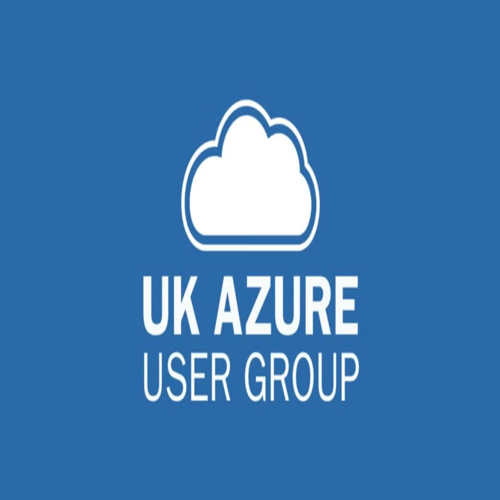

# Global Azure London 

Global Azure London is a community event organized by **UK Azure Users Group**

This event is a great opportunity to meet link-minded people and take a day of learning and fun with other Azure practitioners. Beginner to experienced we've got a bunch of amazing speakers for you to listen to in the morning and a set of hands on labs in the afternoon. We'll have breakfast, lunch and coffee on tap for you!

## Call for Speakers

The [Call for Speakers is open](https://sessionize.com/global-azure-bootcamp3757). Don't wait to the last day to submit your sessions!!!

## Key information

* 📅 May 8th
* In-Person in @ 11 Toynbee Street, London E1 7NE, starts 930AM
* 🎙️Call for speakers - [https://sessionize.com/global-azure-bootcamp3757](https://sessionize.com/global-azure-bootcamp3757)

## Agenda

The agenda will be updated once the call for speakers has ended @ [https://www.meetup.com/ukazureusergroup](https://www.meetup.com/ukazureusergroup)

## Organizers

If you have any questions, feedback or thoughts, please reach out to [Richard Conway](richard@elastacloud.com)